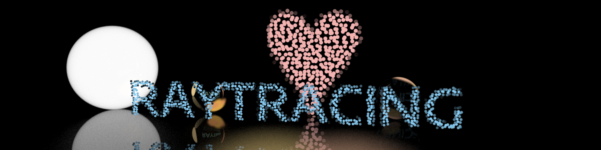

# Summer-Ray-Tracer

> SJTU ACM Honors Class 2023 Ray Tracer Project with Rust!

**Before you start, please read this README carefully**, and there is no useless information in this document.

### Introduction

Briefly, you need to build a toy ray tracer in this project with the Rust language.

### Where can you Learn about Ray Tracing?

Our project is based on the [***Ray Tracing In One Weekend***](https://raytracing.github.io/) book series, containing three books, which is a great resource for beginners to learn about ray tracing.

Most of your jobs are just reading and trying to understand the books, and implementing the books' C++ code in Rust. (That sounds so easy, right?)

### Rust Language

#### Installation

> https://www.rust-lang.org/tools/install

In `Linux` and `MacOS` systems, you can install Rust with the following command:

```bash
curl https://sh.rustup.rs -sSf | sh
```

After that, remember to set the environment variable in `~/.bashrc` (or `~/.zshrc`):

For some reason, you may need to do this to get access to the `crates.io`

- Create the file `~/.cargo/config`
- Add the following content to the file

```toml
[http]
proxy = "127.0.0.1:7890" # your own proxy address

[https]
proxy = "127.0.0.1:7890" # your own proxy address

[source.crates-io]
replace-with = 'ustc'

[source.ustc]
registry = "git://mirrors.ustc.edu.cn/crates.io-index"
```

#### Grammar Study

This is probably your first time to use Rust, so there are some resources for you to learn Rust:

- [*Rust Programming Language*](https://doc.rust-lang.org/book/title-page.html) is the most used book for a beginner
  - [*Rust 程序设计语言 简体中文版*](https://kaisery.github.io/trpl-zh-cn/title-page.html), the Chinese translation
- [*Rust 语言圣经*](https://course.rs/about-book.html)
- [*The Cargo Book*](https://doc.rust-lang.org/cargo/index.html)
- [*Rust By Example*](https://doc.rust-lang.org/rust-by-example/index.html)
- [*Rust Nomicon*](https://doc.rust-lang.org/nomicon/index.html) is for advanced users. E.g. you can learn how to write unsafe code in Rust

#### Something you should know about Rust

- `Module` instead of `include`
- `Trait` instead of `inheritance`
- Syntactically similar to C++
- Well designed, ensuring memory safe without garbage collection
- Strict compile-time check
- Ownership, lifetime, borrow checker, smart pointers...
- Hard to learn...

### The Framework of the Project

```
.
├── Cargo.lock
├── Cargo.toml
├── doc
├── .github
│   └── workflows
│       └── run.yml
├── .gitignore
├── LICENSE
├── output
│   ├── book1
│   │   └── image1.jpg
│   ├── book2
│   ├── book3
│   └── works
├── raytracer
│   ├── Cargo.toml
│   ├── sources
│   └── src
│       └── main.rs
├── README.md
└── rust-toolchain
```

We strongly recommend you to use this framework to build your project, as you can see, this framework is already simple enough, and you can add your own code in the `raytracer` folder.

- `doc`: A folder to contain your report
- `output`: A folder to contain your output images
    - Each book has its own folder, which contains all the images shown in the chapters but should be generated by your own ray tracer
    - This folder should not be uploaded to `Github`, as it may be too large or change too frequently, so it should be added to `.gitignore`
- `.github/workflows/run.yml`: This file is used to run your code in `Github Actions`, which is a CI/CD tool.
By the way, `output` folder can be generated automatically by `Github Actions`.
- `raytracer/src`: This folder contains you main code
- `raytracer/sources`: If you want to import some 3D models or textures, you can put them in this folder
- `rust-toolchain`: Do not forget to add this file to your project, or you may not be able to compile your code

### Tasks

#### Task 0: Preparation

Just do some preparation work, including:

- Read the **README** carefully, so that you know how to start your project
- Correctly install Rust and Cargo
- Figure out how to compile rust code, using `rustc` or `cargo`
- Learning Rust language. Read a few chapters of the `Rust Programming Language` book
    - The first 6 chapters are enough for you to start your project
    - Chapter 10, 15, 16... the more, the better
    - Maybe at first you just know how to write a `Hello World` program or how to output the first image in the book, as long as you can complete the current task, it is enough

#### Task 1 (20 pts): *Ray Tracing In One Weekend*

- Complete [the first book](https://raytracing.github.io/books/RayTracingInOneWeekend.html)
- Save each output image in the `output` folder

#### Task 2 (20 pts) : *Ray Tracing: The Next Week*

- Complete [the second book](https://raytracing.github.io/books/RayTracingTheNextWeek.html)
- Save each output image in the `output` folder.

#### Task 3 (30 pts) : *Ray Tracing: The Rest of Your Life*

- Complete [the third book](https://raytracing.github.io/books/RayTracingTheRestOfYourLife.html)
- Save each output image in the `output` folder

- Write a simple report about the PDF method in this book, at least 2 pages

#### Task 4 (10 pts): Advanced features

- Multi-threading to accelerate your ray tracer
- Exploring some [rust features](./doc/rust-bonus.md)
- Make a benchmark for your ray tracer
- Support for `.obj` file
    - An `obj-loader` is needed
    - Polygons are supported (optional)
- Some [CG-related techniques](./doc/CG-bonus.md)
- Some other interesting features. Please contact TAs if you have any ideas

#### Task 5 (10 pts): Final scene

- Complete a final scene, which should be more complex than the scenes in the books. If your work looks pretty or has aesthetic value, you will get extra points
- Or, your final scene can just be a banner or a logo of our project `Ray Tracing`. Look at the current banner at the top of this page, you can make a better one, with your own ray tracer

#### Task 6 (10 pts): Code review

### Basic Requirements

- Remember to provide each book's generated images. Finally, you should upload the `output` folder to `Github Releases`
- Pass the checks in `Github Actions`, including (already included in `run.yml`):
    - `cargo fmt --all -- --check`
    - `cargo clippy --all -- -D warnings`
    - `cargo test --all`
    - `cargo build --all --release`
    - `cargo run --all --release`
- Each image output commit should be tagged, if tagged, `run.yml` settings will run your code and generate the output images. You should **let us directly see the output images (a '.zip' file) in the `Github Actions` page**

### Assignments

- For students in ACM Class:
  - You are supposed to finish all tasks above
  - Recommended timeline:
    - **Day 1:**  Task 0: Environment setup
    - **Day 2 - 3:** Task 0: Learn Rust
    - **Day 4 - 6:** Task 1
    - **Day 7 - 9:** Task 2
    - **Day 10 - 12:** Task 3
    - **Day 13 - 19:** Task 4 & 5
    - **Day 20:** Pre & Task 6

- For students in SEIEE CS:
  - You are supposed to finish `Task0`, `Task1 (40pts)`, `Task2 (40pts)`, `Task5 (10pts)` and `Task6 (10pts)`
  - Recommended timeline:
    - **Day 1:**  Task 0: Environment setup
    - **Day 2 - 3:** Task 0: Learn Rust
    - **Day 4 - 6:** Task 1 & 5
    - **Day 7 - 9:** Task 2 & 5
    - **Day 10:** Pre & Task 6

### More Tips

- You should have a document recording all the bonus you have done. For each bonus, you should show the code or a benchmark of your work.
- There is no restriction on unsafe code, if you think it is necessary, you can use it, and explain why you need it in code review.
- There will be 2 students to do presentations for ACM Class and SEIEE CS. They will get extra points based on their presentations, no more than 10 points.
