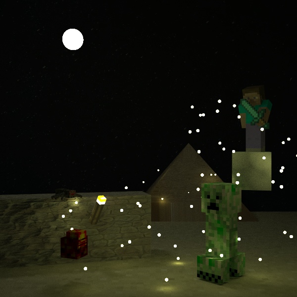
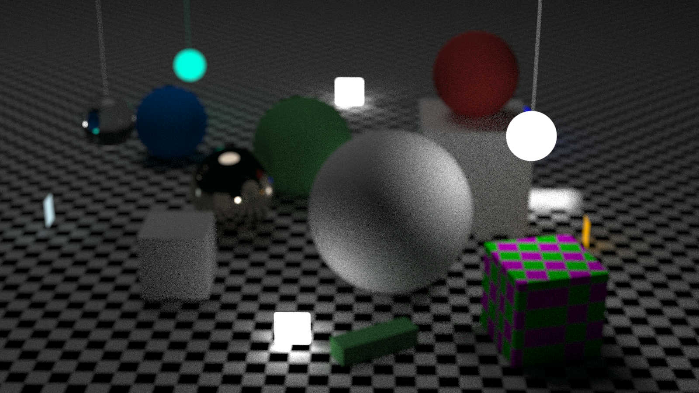
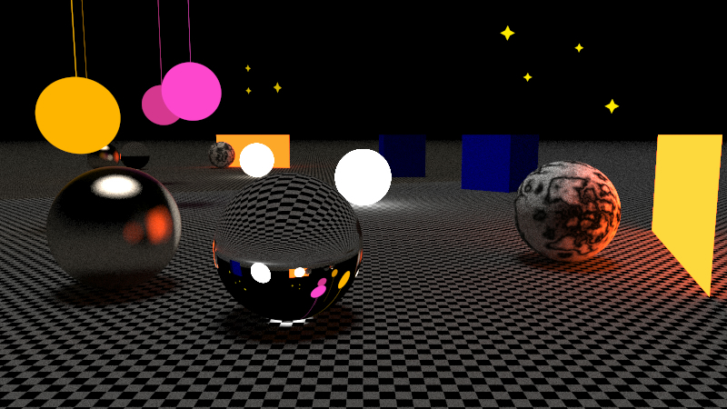
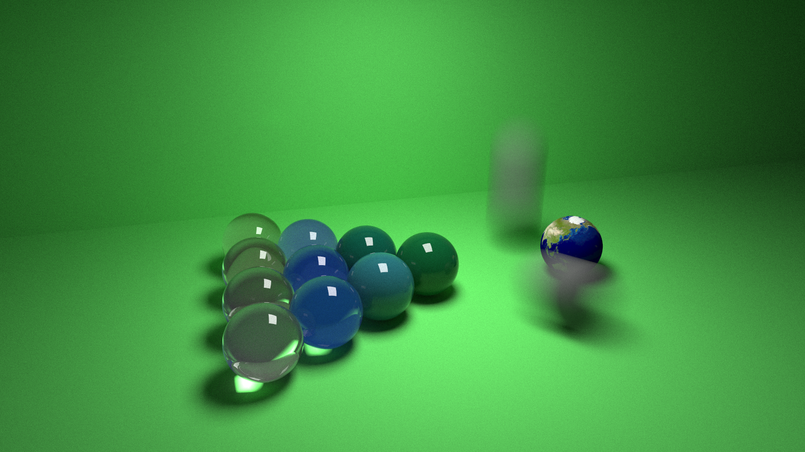
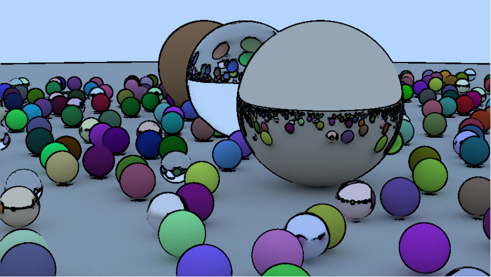
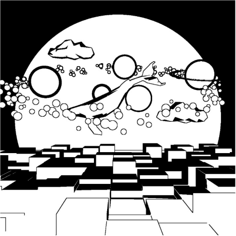
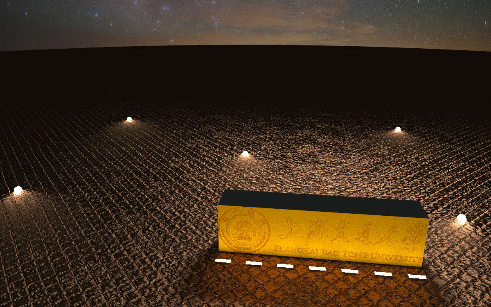
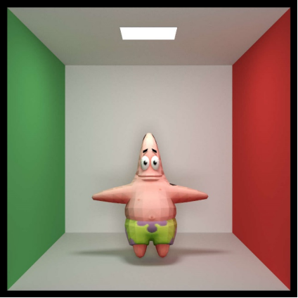

# Final works 2022

Reference to [raytracer-2022](https://github.com/ACMClassCourse-2021/PPCA-Raytracer-2022/tree/main/final_works).

## Advanced features

### Edge detection

### Normal mapping

### interpolation

